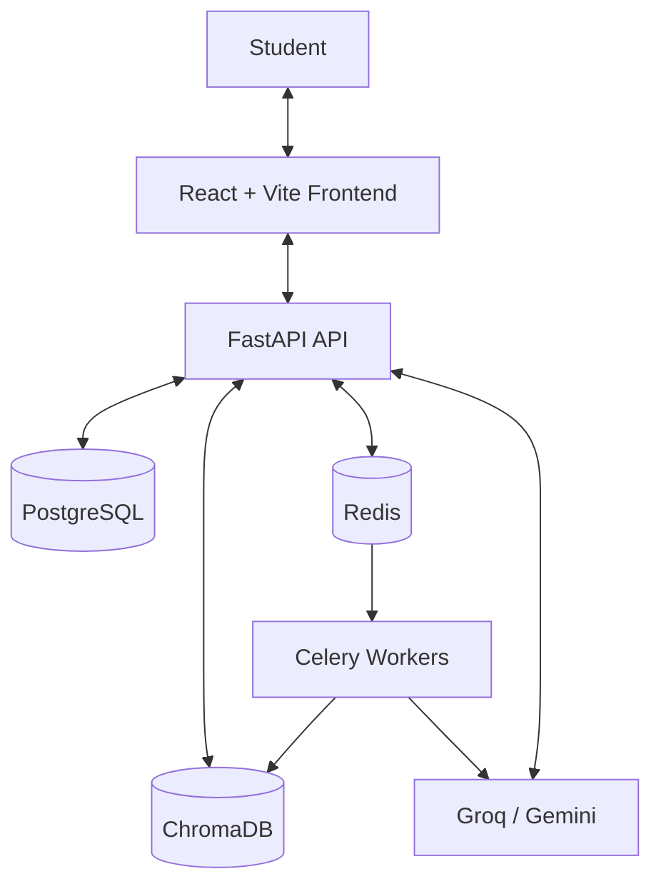

Good decision. For Shiro, **reconstructing `README.md` from scratch is better than continuously patching the old one**, especially because the local implementation has moved significantly ahead of the GitHub version.

The new README should be the **single source of truth** and should reflect the current local implementation, not old claims.

I’d structure it around:

1. **Shiro.ai overview + positioning**
2. **Key student features**
3. **Screenshots/demo**
4. **Architecture diagram**
5. **Frontend/backend structure**
6. **AI + RAG pipeline**
7. **Learning engines** — FSRS, Feynman, quizzes, etc.
8. **Production engineering** — Gates 0–4 and current verified state
9. **Tech stack**
10. **Local development/setup**
11. **Environment variables**
12. **Docker deployment**
13. **Testing & verification** — 78/78 currently verified
14. **Known limitations / current roadmap**
15. **Project structure**
16. **Contributing**
17. **License/contact**

### One important rule

Don't put inflated claims like:

> “Production-ready”
> “100% hallucination-free”
> “ChatGPT alternative”

unless they're actually defensible.

Instead say exactly what has been verified. Your audit already distinguishes engineering tests from real RAG quality evaluation, which is the right approach. 

Also, the new README should explicitly distinguish:

**Implemented ✅**
**In refinement 🔄**
**Planned 📋**

That will make the project look much more professional to recruiters, contributors, and potential users.


Yes. For **Shiro.ai**, I would reconstruct `README.md` from scratch as a **professional product + engineering document**, not as a generic GitHub README.

The README should let three people understand the project quickly:

**Student/user → What is Shiro and why should I use it?**
**Developer → How is it built and how do I run it?**
**Reviewer/recruiter → What makes the project technically impressive?**

Your current architecture and the verified Gates 0–4 work give you enough substance for a strong README. The report confirms the backend has security, data consistency, AI/RAG, observability, and distributed WebSocket layers, plus the learning engines and frontend foundation. 

# 1. Start with the README's purpose

Do **not** start with 100 lines of installation commands.

Start with the product.

The first screen should communicate:

```text
SHIRO.AI
Your AI Learning Operating System

Turn your study material into understanding,
active recall, and measurable progress.

[ Live Demo ] [ Documentation ] [ GitHub ]
```

Then immediately show:

* what it does
* who it is for
* why it is different

---

# 2. Recommended README structure

I would use this exact order:

```text
1. Hero
2. Product Overview
3. Why Shiro
4. Core Features
5. How Shiro Works
6. Architecture
7. Tech Stack
8. Feature Breakdown
9. Screenshots / Demo
10. Project Structure
11. Getting Started
12. Environment Variables
13. Local Development
14. Testing
15. Production / Deployment
16. Security
17. AI / RAG Architecture
18. Performance & Reliability
19. Roadmap
20. Contributing
21. License
22. Author
```

This order matters.

A recruiter shouldn't have to scroll through Docker commands before understanding what Shiro actually is.

---

# 3. Hero section

Keep this short.

Example:

```md
# 🌿 Shiro.ai

### Your AI Learning Operating System

Shiro transforms textbooks, lecture notes, research papers, PDFs,
and other study material into an interactive learning environment
built around active recall, spaced repetition, AI tutoring,
grounded answers, and measurable progress.

[Live Demo](#) · [Documentation](#) · [Report a Bug](#)
```

Then badges:

```md


```

Don't create 30 badges.

Use only meaningful ones.

---

# 4. Add a one-paragraph product explanation

This answers:

> What exactly is Shiro?

For example:

```md
## What is Shiro?

Shiro.ai is a student-first AI Learning Operating System that turns
passive study material into active learning workflows.

Instead of using separate tools for reading, summarizing, quizzing,
flashcards, revision, and progress tracking, Shiro connects these
experiences into a single learning loop:

**Understand → Practice → Recall → Evaluate → Review → Improve**
```

This is your core product story.

---

# 5. Explain the problem

This makes the README much more compelling.

```md
## The Problem

Traditional study workflows are fragmented:

- PDFs are read in one app.
- Notes are stored somewhere else.
- Quizzes are generated manually.
- Flashcards are maintained separately.
- Progress is disconnected from actual performance.
- AI answers often lack source grounding.

Shiro brings these workflows together into one environment.
```

This makes the project feel like a product rather than a collection of student features.

---

# 6. Explain Shiro's solution

Then:

```md
## The Shiro Approach

A student can upload study material and use the same knowledge
base to:

1. Ask contextual questions.
2. Generate grounded summaries.
3. Create quizzes.
4. Build flashcards.
5. Practice using the Feynman technique.
6. Generate mind maps.
7. Create audio learning material.
8. Track retention and performance.
9. Receive personalized study recommendations.
```

The exact capabilities should match what is actually implemented.

---

# 7. Feature section

Don't dump 20 features into one unordered list.

Group them.

### AI Learning

```md
### 🧠 AI Learning

- Context-grounded AI chat
- Hybrid RAG
- Citation-backed answers
- Feynman learning mode
- AI summarization
- Exam answer planning
```

### Active Recall

```md
### 🎯 Active Recall

- AI-generated quizzes
- Flashcards
- FSRS-based scheduling
- Weak-topic identification
- Review workflows
```

### Knowledge

```md
### 📚 Knowledge Workspace

- PDF/document ingestion
- OCR
- Document chat
- Knowledge graph
- Mind maps
- Cross-document analysis
```

### Study Experience

```md
### ⏱ Study Experience

- Study Rooms
- Pomodoro sessions
- Ambient audio
- Progress tracking
- Streaks
- Study plans
```

This is much easier to scan.

---

# 8. Explain what makes Shiro different

This section is important.

Don't say:

> "Shiro is like ChatGPT but for students."

That weakens the project.

Say:

```md
## Why Shiro?

Shiro is designed around the learning loop rather than the chatbot
alone.

A conversation can lead directly into a quiz, flashcard session,
Feynman challenge, or revision workflow while remaining grounded in
the student's own study material.

The goal is not simply to answer a question, but to help the student
retain and apply the knowledge.
```

That is your differentiation.

---

# 9. Explain the learning loop visually

Use Mermaid.

````md
```mermaid
flowchart LR
    A[Study Material] --> B[Knowledge Extraction]
    B --> C[Hybrid Retrieval]
    C --> D[AI Tutor]
    D --> E[Practice]
    E --> F[Evaluation]
    F --> G[Spaced Repetition]
    G --> H[Progress & Insights]
    H --> D
````

````

This is much more effective than a huge paragraph.

---

# 10. RAG architecture section

This is where you can show engineering depth.

Your verified architecture already uses dense + BM25 retrieval combined with RRF, with provenance-tracked citations. :contentReference[oaicite:1]{index=1}

Show:

```md
## RAG Architecture

Shiro uses a hybrid retrieval pipeline combining:

- Dense vector retrieval using ChromaDB
- BM25 lexical retrieval
- Reciprocal Rank Fusion (RRF)
- Document/version isolation
- Citation provenance
- AI quality validation
````

Then Mermaid:

```mermaid
flowchart LR
    Q[Student Query]
    Q --> D[Dense Retrieval]
    Q --> B[BM25 Retrieval]

    D --> R[RRF]
    B --> R

    R --> C[Evidence Chunks]
    C --> G[AI Gateway]
    G --> V[Quality Validation]
    V --> A[Grounded Answer]
    A --> S[Citations]
```

This will look very strong on GitHub.

---

# 11. AI Gateway section

Explain the actual provider architecture.

Your current verified setup has centralized AI gateway and provider fallback. 

Example:

```md
## AI Gateway

Shiro routes AI requests through a centralized gateway responsible for:

- Provider selection
- Fallback handling
- Usage tracking
- Token accounting
- Cost monitoring
- Structured output validation
- Prompt versioning

Current providers:

- Groq
- Gemini
- OpenAI compatibility layer
```

Since you told me Groq and Gemini are your actual active providers, phrase OpenAI carefully if it's mainly a compatibility/fallback path rather than your current deployment provider.

---

# 12. Architecture diagram

You already have one.

Make it polished.



Then below it explain the responsibility of each piece.

---

# 13. Backend architecture

Explain:

```text
routers
services
models
database
utils
prompts
middleware
tests
```

But don't document every Python file.

Example:

```md
### Backend

| Layer | Responsibility |
|---|---|
| routers | API and WebSocket endpoints |
| services | Domain/business logic |
| models | SQLAlchemy + Pydantic models |
| database | SQL and vector persistence |
| utils | AI, security, processing, metrics |
| prompts | Versioned AI prompt registry |
| middleware | Request tracing and telemetry |
| tests | Unit, security, integration, resilience |
```

This makes your architecture immediately understandable.

---

# 14. Frontend architecture

Do the same.

Your planned restructuring should be reflected **after it is actually implemented**.

For the new structure:

```text
src/
├── app/
├── features/
│   ├── auth/
│   ├── chat/
│   ├── study/
│   ├── library/
│   ├── collaboration/
│   └── insights/
├── components/
│   ├── ui/
│   ├── navigation/
│   └── common/
├── contexts/
├── hooks/
├── api/
└── styles/
```

Then explain the philosophy:

> "Frontend code is organized by business domain rather than page type."

That is a much stronger statement than just showing folders.

---

# 15. Screenshots

Your README absolutely needs this.

Don't put 15 huge screenshots vertically.

Use a 2×2 or 3×2 layout.

For example:

```md
## Product Preview

| Dashboard | AI Chat |
|---|---|
|  |  |

| Library | Study Room |
|---|---|
|  |  |
```

Recommended screenshots:

1. Dashboard
2. Chat
3. Document workspace
4. Quiz
5. Flashcards
6. Study Room
7. Progress
8. Mind Map

The screenshot you just showed me should definitely be part of the README after the final premium UI revision.

---

# 16. Tech stack table

Keep it clean.

```md
## Tech Stack

| Category | Technology |
|---|---|
| Frontend | React 18, Vite, Tailwind CSS |
| Animation | Framer Motion / Motion |
| Backend | FastAPI |
| Database | PostgreSQL / SQLAlchemy |
| Vector DB | ChromaDB |
| Retrieval | BM25 + Dense Retrieval + RRF |
| Background Jobs | Celery |
| Queue / PubSub | Redis |
| AI | Groq + Gemini |
| Auth | JWT |
| Monitoring | Prometheus |
| Containers | Docker / Docker Compose |
| Testing | Pytest + Playwright |
```

Only list technologies genuinely used.

---

# 17. Getting Started

This should be extremely practical.

Structure it:

```text
Prerequisites
↓
Clone
↓
Backend setup
↓
Frontend setup
↓
Environment variables
↓
Database setup
↓
Run application
```

For example:

```md
## Getting Started

### Prerequisites

- Python 3.11+
- Node.js 18+
- PostgreSQL
- Redis
- Git
- Docker (recommended)

### Clone

git clone ...
cd shiro.ai
```

Then separate backend/frontend.

---

# 18. Environment variables

This needs its own section.

Never put actual secrets.

Example:

```env
DATABASE_URL=
REDIS_URL=

JWT_SECRET=
JWT_ALGORITHM=

GROQ_API_KEY=
GEMINI_API_KEY=

CHROMA_PERSIST_DIRECTORY=

CORS_ORIGINS=
```

Then explain which are required and which are optional.

---

# 19. Docker section

Give users the fastest path first.

```md
## Run with Docker

docker compose up --build
```

Then:

```md
Frontend: http://localhost:5173
Backend: http://localhost:8000
API Docs: http://localhost:8000/docs
```

Only provide these URLs if they're actually correct in your configuration.

---

# 20. Development section

Show separate commands:

```bash
# Backend
cd Backend
python -m uvicorn main:app --reload

# Worker
celery -A celery_app worker --loglevel=info

# Frontend
cd Frontend
npm install
npm run dev
```

Again, use your actual scripts rather than assuming.

---

# 21. Testing section

This is where your **78/78** result belongs.

But be precise.

Your report states:

**78/78 backend tests passed**. 

Write:

```md
## Testing

### Backend

The current backend regression suite contains coverage for:

- Authentication
- Authorization
- Tenant isolation
- SSRF protection
- Data consistency
- AI gateway behavior
- RAG retrieval
- Citation provenance
- Health probes
- Observability
- WebSocket resilience
- Backup/restore

Current verified result:

**78 / 78 tests passing**
```

Do **not** say:

> "100% test coverage"

unless you've actually measured line/branch coverage.

That's an important README credibility issue.

---

# 22. Performance section

Put your stress results here.

Your report gives:

* 30 concurrent workers
* 500 requests
* 0% error rate

and endpoint p50/p95 numbers.


Write:

```md
## Performance

Baseline stress testing was performed with:

- 30 concurrent workers
- 500 requests
- 0.00% observed request failures

| Endpoint | p50 | p95 |
|---|---:|---:|
| /health | 163 ms | 496 ms |
| /auth/guest | 166 ms | 577 ms |
| /dashboard | 353 ms | 422 ms |
| /activity | 425 ms | 547 ms |
```

But label it **baseline**, not universal production capacity.

---

# 23. Production architecture

This section should explain your Release Gates.

Rather than writing four pages of detail, use a table:

```md
## Production Readiness

| Gate | Scope | Status |
|---|---|---|
| Gate 0 | Security & authorization | ✅ Passed |
| Gate 1 | Data consistency & ingestion | ✅ Passed |
| Gate 2 | AI gateway & RAG quality | ✅ Passed |
| Gate 3 | Observability & health | ✅ Passed |
| Gate 4 | Distributed realtime resilience | ✅ Passed |
```

Then:

> Current backend regression suite: **78/78 passing**.

Your detailed engineering reports can contain the deeper material.

The README should remain readable.

---

# 24. Security section

This is important because it demonstrates real engineering.

Mention:

```text
JWT authentication
Tenant isolation
IDOR protection
SSRF protection
Secret redaction
Request correlation
Validation
Rate limiting / quotas
```

Your report explicitly verifies tenant isolation and SSRF protection. 

Don't claim "completely secure."

Say:

> "Security controls currently implemented include..."

That is technically honest.

---

# 25. Folder structure

Show a **simplified** structure.

Not the entire 200-file tree.

Something like:

```text
shiro.ai/
├── Backend/
│   ├── routers/
│   ├── services/
│   ├── models/
│   ├── database/
│   ├── prompts/
│   ├── utils/
│   ├── middleware/
│   └── tests/
│
├── Frontend/
│   └── src/
│       ├── features/
│       ├── components/
│       ├── hooks/
│       ├── contexts/
│       └── api/
│
├── docker-compose.yml
└── README.md
```

That is enough.

---

# 26. Roadmap

This should show **what is actually next**, not fictional features.

For current Shiro:

```md
## Roadmap

### Current focus
- [x] Backend production gates 0–4
- [x] Hybrid RAG
- [x] FSRS learning engine
- [x] Citation-aware chat
- [ ] Streaming AI chat
- [ ] Long-session context optimization
- [ ] RAG evaluation benchmark
- [ ] Frontend E2E coverage
- [ ] Knowledge Ledger
- [ ] Unified Chat → Study Tool workflows
- [ ] Premium frontend refinement
```

Your current report specifically identifies streaming, better context, the Knowledge Ledger, RAG evals, and frontend E2E as the next major priorities. 

---

# 27. Do not put unfinished features in the "Features" section

This is very important.

For example, if:

**Cross-document Swarm Analytics**

is only partially scaffolded, don't list it as:

> "Fully supported."

Instead:

```md
### Experimental / In Progress

- Cross-document swarm analytics
- Multi-speaker podcast generation
- Frontend browser automation tests
```

Your report explicitly identifies those as in-progress. 

---

# 28. Add a "Design Philosophy" section

This is especially useful now because you're rebuilding the UI.

```md
## Design Philosophy

Shiro is designed around:

- Calm, distraction-free interfaces
- Long-session readability
- Clear learning hierarchy
- Evidence-backed AI responses
- Minimal cognitive overhead
- Fast interactions and purposeful motion

The visual language combines warm neutrals, deep ink typography,
sage actions, and restrained gold accents.
```

This gives the frontend redesign an explicit product philosophy.

---

# 29. Add "How a student uses Shiro"

This is one of the best sections you can add.

```text
Upload material
      ↓
Ask Shiro
      ↓
Understand concept
      ↓
Take quiz
      ↓
Review mistakes
      ↓
Generate flashcards
      ↓
Feynman challenge
      ↓
FSRS review
      ↓
Progress insight
      ↓
Next study recommendation
```

This demonstrates the **product loop** better than 50 feature bullets.

---

# 30. Keep README length under control

I would aim for roughly:

**500–900 lines maximum**

for the main README.

Don't put:

* full API documentation
* every endpoint
* every migration
* every test
* every class
* every configuration option

inside it.

Instead link to:

```text
docs/
├── architecture.md
├── deployment.md
├── api.md
├── rag.md
├── testing.md
└── production-readiness.md
```

This makes your repository much more professional.

---

# 31. Create a docs hierarchy

I'd strongly recommend:

```text
docs/
├── architecture.md
├── ai-rag.md
├── development.md
├── deployment.md
├── testing.md
├── security.md
├── production-readiness.md
└── screenshots/
```

Then `README.md` becomes the **front door**.

---

# 32. Important: separate product claims from engineering claims

For example:

Bad:

> "Shiro delivers hallucination-free AI."

Better:

> "Shiro uses retrieval grounding, provenance-aware citations, and output quality validation to reduce unsupported responses."

Likewise:

Bad:

> "Production-ready at scale."

Better:

> "Release Gates 0–4 have passed the current backend regression suite with 78/78 tests passing; staging/load validation should be performed against the target deployment environment."

That makes your README trustworthy.

---

# 33. Add a "Known Limitations" section

This will actually make the repository look **more mature**.

Based on your current report:

```md
## Known Limitations

- Chat responses are currently synchronous rather than token-streamed.
- Long-session context handling is being improved.
- Frontend E2E automation is not yet integrated into CI.
- CPU embedding model initialization introduces a cold-start delay.
- Some advanced cross-document analytics remain under development.
```

Your report supports these current limitations. 

A professional engineering project doesn't pretend everything is perfect.

---

# 34. End with a strong product statement

Don't end with:

> "Thank you."

End with what Shiro is trying to accomplish.

Something like:

```md
## Vision

Shiro is built around a simple idea:

**AI should not only help students get answers.
It should help them understand, practice, remember, and improve.**

Shiro brings those steps into one continuous learning system.
```

Then:

```md
Built with ❤️ for students and lifelong learners.
```

---

# Final README architecture

I would ultimately make the README flow like this:

```text
SHIRO HERO
    ↓
What is Shiro?
    ↓
Problem
    ↓
Solution
    ↓
Learning Loop
    ↓
Core Features
    ↓
Screenshots
    ↓
Architecture
    ↓
RAG / AI Gateway
    ↓
Tech Stack
    ↓
Project Structure
    ↓
Quick Start
    ↓
Configuration
    ↓
Testing & Performance
    ↓
Production Readiness
    ↓
Security
    ↓
Known Limitations
    ↓
Roadmap
    ↓
Contributing
    ↓
License / Author
```

### One important recommendation for your current work

**Don't let Antigravity generate the README directly from the old README.**

Have it reconstruct the README **from the actual current code + the latest local Release Gate report**, because you've already told me that the GitHub repository is behind the local implementation.

The README should describe **what Shiro actually is today**, not what GitHub happened to contain previously. Your latest report is explicitly intended as the authoritative current state. 

And I would keep the detailed Release Gate reports **outside the README** and link to them from the README. That gives you both a polished public-facing repository and a serious engineering audit trail.
