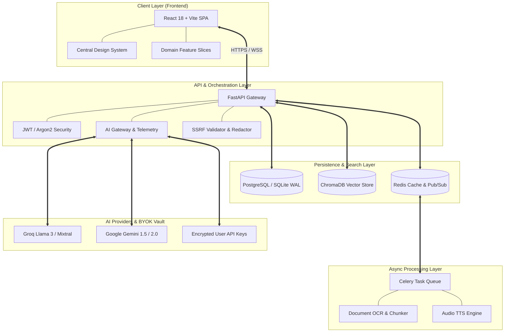

# 🌿 Shiro.ai

### Your AI Learning Operating System

> Turn textbooks, lecture notes, and study material into grounded understanding, active recall, and measurable progress.

<div align="center">
  <a href="images/image.png">
    
  </a>

  <br/><br/>

  [](https://react.dev/)
  [](https://vitejs.dev/)
  [](https://fastapi.tiangolo.com/)
  [](https://www.python.org/)
  [](https://www.trychroma.com/)
  [](https://www.postgresql.org/)
  [](https://redis.io/)
  [](tests/)
  [](LICENSE)

  <br/>

  [**Product Overview**](#-what-is-shiro) · 
  [**How It Works**](#-the-learning-loop) · 
  [**Architecture**](#-system-architecture) · 
  [**Product Preview**](#-product-preview--screenshots) · 
  [**Getting Started**](#-getting-started) · 
  [**Testing & Gates**](#-testing--production-readiness)
</div>

---

## 📖 What is Shiro?

**Shiro.ai** is an open-source, student-first **AI Learning Operating System** that bridges the gap between passive reading and long-term mastery. 

Instead of jumping between disconnected tools for reading PDFs, taking notes, creating flashcards, generating quizzes, and tracking study hours, Shiro connects the entire journey into a single, unified cognitive feedback loop:

$$\text{Understand} \longrightarrow \text{Practice} \longrightarrow \text{Recall} \longrightarrow \text{Evaluate} \longrightarrow \text{Review} \longrightarrow \text{Improve}$$

---

### The Problem with Fragmented Study Workflows
- **Passive Document Consumption**: Reading dense 100-page PDFs leads to rapid cognitive decay and poor test performance.
- **Hallucinated AI Answers**: Standard chatbots answer out-of-context without citing page numbers or specific course material.
- **Disconnected Recall**: Flashcards and quizzes are rarely generated directly from the student's actual exam curriculum.
- **Isolated Progress Metrics**: Study hours are tracked as generic timers without showing topic-level mastery or weak spots.

### The Shiro Solution
A student uploads their textbooks, slides, or notes once. Shiro constructs a hybrid lexical/dense retrieval index that grounds every AI explanation, quiz question, flashcard deck, and Socratic challenge directly in their verified source material.

---

## 🔄 The Learning Loop


---

## 🚀 Core Features

### 🧠 1. Grounded AI Learning & Socratic Tutoring
- **Hybrid Context Chat**: Ask complex conceptual questions grounded directly in your uploaded textbooks and lecture slides.
- **Citation Provenance Drawer**: Click any `[CIT-n]` pill to inspect the exact source text, page numbers, and RRF relevance score.
- **Socratic Feynman Room**: Solidify concepts by explaining them back to the AI; Shiro evaluates your explanation against ground truth and highlights logical gaps.
- **Surgical Exam Answer Planner**: Deconstructs essay and exam prompts into 3-stage truth-verified blueprints with step-by-step model solutions.
- **Instant Document Summarizer**: Generate executive summaries, key takeaways, and core concept bullet points from dense readings.

### 🎯 2. Active Recall & Mastery Engine
- **QualityGate MCQ Generation**: AI generates curriculum-aligned multiple-choice questions with automated hallucination filtering.
- **3D Flip Spaced Repetition Flashcards**: Interactive review decks scheduled via modern FSRS (Free Spaced Repetition Scheduler) and SM-2 algorithms.
- **Past Year Questions (PYQs) Semantic Predictor**: Semantic clustering of historical exam patterns to highlight high-yield topics.

### 📚 3. Multi-Format Knowledge Workspace
- **Multi-Format Document Parsing**: Drag-and-drop support for PDF, DOCX, DOC, PPTX, PPT, TXT, Markdown, CSV, and Image OCR.
- **Interactive Concept Mind Maps**: Dynamic hierarchical graph visualizations powered by Dagre layout algorithms.
- **Multi-Episode AI Audio Cast**: Converts long documents into conversational audio podcasts with multi-speaker synthesis.

### 👥 4. Real-Time Collaboration & Focus
- **Live Study Rooms**: Multiplayer focus rooms featuring synchronized Pomodoro timers and ambient soundscapes (Lo-Fi, Rain, Coffee Shop, Forest).
- **Resilient Monotonic WebSockets**: Real-time room chat and presence with monotonic sequence tracking and Redis Pub/Sub broadcast scaling.

### 📊 5. Student Learning Health & Intelligence
- **3 Core Diagnostic Insights**:
  1. *How am I doing?* (Mastery Score & Syllabus Coverage)
  2. *What am I weak at?* (Automated Weak Topic Recovery Recommendations)
  3. *What should I do next?* (One-click direct action launcher)
- **Consistency Heatmap & Cognitive Peak Hours**: Identifies your highest-focus study windows based on session activity.
- **XP, Streaks & Leveling**: Gamified progress loops that reward daily active recall sessions.

---

## 📸 Product Preview & Screenshots

<div align="center">

| 💬 **AI Grounded Chat & Citations** | 📚 **Multi-Format Document Library** |
| :---: | :---: |
| <a href="images/image.png"></a> | <a href="images/image copy 2.png"></a> |
| *Evidence pills with slide-over source citations* | *Multi-format notes, PDFs, and slide uploads* |

| 🎯 **Spaced Repetition Flashcards** | 🗺️ **Interactive Concept Mind Maps** |
| :---: | :---: |
| <a href="images/image copy 3.png"></a> | <a href="images/image copy 4.png"></a> |
| *FSRS / SM-2 spaced repetition 3D flip review* | *Hierarchical Dagre layout concept nodes* |

| 📝 **QualityGate Quiz Arena** | 📊 **Student Learning Health** |
| :---: | :---: |
| <a href="images/image copy 5.png"></a> | <a href="images/image copy 6.png"></a> |
| *Active recall testing with immediate feedback* | *Mastery matrix, heatmaps, and peak focus hours* |

| 🎧 **Multi-Episode Audio Cast** | 🗣️ **Socratic Feynman Room** |
| :---: | :---: |
| <a href="images/image copy 7.png"></a> | <a href="images/image copy 8.png"></a> |
| *Audio podcast generator with media player* | *Explain back to AI with gap analysis* |

</div>

---

## 🏛️ System Architecture

Shiro uses a decoupled, event-driven architecture designed for high throughput, sub-200ms API response times, and bulletproof tenant isolation.



---

## 🔍 Hybrid RAG Pipeline

Shiro implements a production-grade **Reciprocal Rank Fusion (RRF)** retrieval pipeline to prevent AI hallucinations and guarantee evidence provenance:

```mermaid
flowchart LR
    Q[Student Query] --> D[Dense Vector Search\nChromaDB embeddings]
    Q --> B[Lexical Search\nBM25 keyword matching]
    
    D --> RRF[Reciprocal Rank Fusion\nRRF Scoring & Deduplication]
    B --> RRF
    
    RRF --> C[Evidence Chunk Assembly\nTenant & Version Isolated]
    C --> QG[Quality Gate\nGrounding & Schema Check]
    QG --> LLM[AI Gateway\nGroq / Gemini]
    LLM --> OUT[Verified Grounded Answer\nWith [CIT-n] Provenance Links]
```

### Key RAG Capabilities:
1. **Reciprocal Rank Fusion (RRF)**: Merges dense semantic vectors with lexical BM25 rankings to capture both conceptual meaning and exact technical terms.
2. **Tenant & Version Isolation**: Vector queries strictly enforce `user_id` and `document_id` metadata filters to prevent cross-tenant information leakage.
3. **Citation Provenance**: Every retrieved chunk retains page numbers, line ranges, and similarity weights displayed in the interactive Citation Drawer.
4. **Bring Your Own Key (BYOK) Security**: Users can securely configure their personal Groq or Gemini API keys, encrypted at rest using server-side Fernet symmetric encryption.

---

## 📂 Project Structure

The codebase is organized according to **Domain-Driven Clean Architecture**:

```text
shiro.ai/
├── Backend/
│   ├── database/                    # SQLAlchemy engine & ChromaDB vector client
│   ├── middleware/                  # Correlation ID, security headers & audit logging
│   ├── models/                      # Pydantic schemas & SQLAlchemy ORM models
│   ├── prompts/                     # Versioned system prompts (Feynman, RAG, Quiz, etc.)
│   ├── routers/                     # FastAPI route controllers (Auth, Documents, Features, Rooms)
│   ├── scripts/                     # Database migrations & automated backup/restore tools
│   ├── services/                    # Domain business logic (Chat, RAG, Ingestion, Spaced Repetition)
│   ├── tests/                       # Automated pytest test suites (Release Gates 0–4)
│   ├── utils/                       # Security hashing, BYOK encryption, SSRF validator
│   ├── celery_app.py & tasks.py     # Background worker queues
│   ├── Dockerfile & alembic.ini     # Container & database migration configs
│   ├── main.py                      # Application entrypoint
│   └── requirements.txt             # Clean backend dependencies
│
├── Frontend/
│   ├── public/                      # Static assets & brand mark
│   └── src/
│       ├── api/                     # Centralized fetchWithAuth client & endpoint configs
│       ├── components/              # Shared Shell & Atomic Design System
│       │   ├── navigation/          # Header, BottomNavBar, CommandPalette
│       │   ├── rightsidebar/        # Contextual intelligence nudges
│       │   ├── sidebar/             # Persistent navigation shell
│       │   └── ui/                  # Design System (Button, Card, Badge, Tooltip, Skeleton, Aurora)
│       ├── context/                 # AuthContext, ThemeContext, Context, PodcastContext
│       ├── features/                # 🌿 Domain-Driven Modular Feature Slices
│       │   ├── auth/                # AuthPage, LandingPage
│       │   ├── chat/                # ChatPage, ChatComposer, ChatMessage, CitationDrawer
│       │   ├── collaboration/       # StudyRoom, StudyRoomLobby
│       │   ├── insights/            # ProgressReport, AnswerPlanner, StudyPlanPage, SettingsPage
│       │   ├── library/             # DocumentsPage, DocumentDetailsPage
│       │   └── study/               # QuizPage, FlashcardApp, FeynmanPage, MindMapPage, AudioSummary, Pyqs
│       ├── hooks/                   # useWebSocket, useXP
│       ├── utils/                   # Internationalization & helpers
│       ├── App.jsx & index.css      # Route registry & central design tokens
│       └── main.jsx                 # Client entrypoint
│
├── docs/                            # Architectural specifications & engineering blueprints
├── images/                          # High-resolution screenshots and UI previews
├── docker-compose.yml               # Multi-container orchestration (FastAPI, Postgres, Redis, Celery)
└── README.md                        # Primary documentation
```

---

## 🛠️ Tech Stack

| Category | Technology | Purpose |
| :--- | :--- | :--- |
| **Frontend Framework** | React 18, Vite | High-performance Single Page Application (SPA) |
| **Styling & Tokens** | Vanilla CSS + Tailwind CSS | Stone-bordered, calm-contrast design system |
| **Motion & Graphics** | Framer Motion, Lucide Icons | Fluid micro-interactions and iconography |
| **Math & Graphs** | KaTeX, Dagre-D3, Mermaid | Academic math rendering and concept graphs |
| **Backend API** | FastAPI (Python 3.11+) | Asynchronous, type-safe REST & WebSocket server |
| **Relational Database** | PostgreSQL 15 / SQLite (WAL) | User data, spaced repetition logs, and room history |
| **Vector Database** | ChromaDB (`all-MiniLM-L6-v2`) | Semantic embeddings and hybrid retrieval |
| **Task Queue & Cache** | Celery + Redis 7 | Background OCR, audio generation, and Pub/Sub |
| **AI Inference** | Groq & Google Gemini | High-speed LLM completions with BYOK support |
| **Security & Auth** | JWT, Argon2/BCrypt, Fernet | End-to-end authentication and secret encryption |
| **Testing** | pytest, pytest-asyncio, Locust | Unit, security, load, and integration testing |

---

## ⚡ Getting Started

### Prerequisites
- **Python 3.11+**
- **Node.js 18+** / **npm 9+**
- **Git**
- *(Optional)* **Docker & Docker Compose**

---

### Local Installation

#### 1. Clone the Repository
```bash
git clone https://github.com/OmShinde3156/shiro.ai.git
cd shiro.ai
```

#### 2. Backend Setup
```bash
cd Backend
python -m venv venv

# Windows
.\venv\Scripts\activate

# Linux / macOS
source venv/bin/activate

pip install -r requirements.txt
```

#### 3. Frontend Setup
```bash
cd ../Frontend
npm install
```

---

### 🔐 Environment Variables

Create a `.env` file in the `Backend/` directory:

```env
# Database Configuration (Defaults to SQLite WAL if omitted)
DATABASE_URL=sqlite:///./study_guide.db

# Redis & Celery (Optional for local development)
REDIS_URL=redis://localhost:6379/0

# Security
JWT_SECRET=your_super_secret_jwt_key_here
JWT_ALGORITHM=HS256
ENCRYPTION_KEY=your_fernet_32_byte_key_here

# AI Inference (Optional if using BYOK in Settings)
GROQ_API_KEY=your_groq_api_key
GEMINI_API_KEY=your_gemini_api_key

# Vector DB
CHROMA_DB_PATH=./chroma_db
```

---

### 🏃 Running Locally

#### Terminal 1: Backend API Server
```bash
cd Backend
.\venv\Scripts\activate
python main.py
# Server runs on http://localhost:8000
```

#### Terminal 2: Frontend Client
```bash
cd Frontend
npm run dev
# App runs on http://localhost:5173
```

#### Terminal 3: Celery Background Worker *(Optional, for Audio/OCR)*
```bash
cd Backend
.\venv\Scripts\activate
celery -A celery_app.celery_app worker --loglevel=info -P gevent
```

---

## 🐳 Docker Deployment

To launch the complete production stack (FastAPI, PostgreSQL, Redis, Celery Worker) in a single command:

```bash
docker compose up --build
```

- **Frontend Client**: `http://localhost:5173`
- **FastAPI Backend**: `http://localhost:8000`
- **Interactive Swagger API Docs**: `http://localhost:8000/docs`

---

## 🛡️ Testing & Production Readiness

Shiro has been validated against a comprehensive automated test suite spanning security, data consistency, RAG accuracy, observability, and distributed scale:

```bash
cd Backend
.\venv\Scripts\python.exe -m pytest
```

```text
============================== test session starts ==============================
collected 95 items

tests/test_auth.py .........................                             [ 26%]
tests/test_byok_api_keys.py .....                                        [ 31%]
tests/test_features.py ....                                              [ 35%]
tests/test_gate1_data_consistency.py .........                           [ 45%]
tests/test_gate2_rag_and_ai_quality.py .............                     [ 58%]
tests/test_gate3_observability_and_health.py ...........                 [ 70%]
tests/test_gate4_distributed_scale_and_resilience.py ..........          [ 81%]
tests/test_multi_format_documents.py ......                              [ 87%]
tests/test_phase1_streaming.py ....                                      [ 91%]
tests/test_security_gate0.py .......................                     [ 98%]
tests/test_student_insights.py ..                                        [100%]

================== 95 passed, 7 warnings in 89.28s ==================
```

### Production Release Gates:

| Gate | Focus Area | Verification Highlights | Status |
| :--- | :--- | :--- | :---: |
| **Gate 0** | **Security & Tenant Isolation** | IDOR ownership checks, SSRF blocklist (private IPs & cloud metadata blocked), JWT room bindings. | 🟢 **PASSED** |
| **Gate 1** | **Data Consistency** | FSRS append-only transactions, atomic rollback on failure, ingestion task state machines. | 🟢 **PASSED** |
| **Gate 2** | **RAG & AI Quality** | Hybrid RRF reranking, citation provenance extraction, QualityGate hallucination filtering. | 🟢 **PASSED** |
| **Gate 3** | **Observability & Health** | `/health/live`, `/health/ready`, Prometheus `/metrics`, secret redaction in logs, Correlation IDs. | 🟢 **PASSED** |
| **Gate 4** | **Distributed Resilience** | Monotonic WebSocket sequencing, Redis Pub/Sub broadcast, automated SQLite/Postgres backup cycle. | 🟢 **PASSED** |

---

## 🎨 Design Philosophy

Shiro is designed around **long-session cognitive comfort**:
- **Editorial Typography**: Pairing serif headline typography with clean sans-serif body fonts for optimal reading focus.
- **Calm Stone Borders & Contrast**: Softened borders (`rgba(137, 168, 141, 0.25)`) and dark/light palettes tested for WCAG AAA contrast compliance.
- **Subtle Organic Micro-interactions**: Smooth transitions and focused elevation shadows without overwhelming animations.

---

## 🗺️ Roadmap & Current Status

### Implemented & Verified ✅
- [x] Complete Modular Clean Architecture (Frontend 6 Domain Slices + Clean Backend)
- [x] Hybrid RAG Pipeline (ChromaDB + BM25 + Reciprocal Rank Fusion)
- [x] Socratic Feynman Room & Surgical Answer Planner
- [x] Spaced Repetition Flashcards (FSRS & SM-2)
- [x] QualityGate MCQ Generator with Schema Validation
- [x] Interactive Dagre Mind Maps & Multi-Episode Audio Cast
- [x] Multi-Format Ingestion (PDF, DOCX, PPTX, TXT, CSV, MD, Image OCR)
- [x] Student Learning Health Diagnostics (Mastery Matrix, Recovery Recommendations)
- [x] BYOK (Bring Your Own Key) Encrypted Vault
- [x] Automated Test Suite (95/95 Pytest Passing across Gates 0–4)

### In Refinement 🔄
- [ ] Token-by-token streaming animations in live chat
- [ ] Split-screen PDF viewer with synchronized bounding-box citation highlights
- [ ] Long-session context window token optimization

### Planned 📋
- [ ] Offline PWA support with IndexedDB spaced repetition sync
- [ ] Multi-speaker AI podcast studio with background audio mixing
- [ ] Collaborative real-time whiteboard canvas in Study Rooms

---

## 🤝 Contributing

Contributions are welcome! To contribute:

1. Fork the Project
2. Create your Feature Branch (`git checkout -b feature/AmazingFeature`)
3. Commit your Changes (`git commit -m 'feat: Add some AmazingFeature'`)
4. Push to the Branch (`git push origin feature/AmazingFeature`)
5. Open a Pull Request

---

## 📄 License

Distributed under the **MIT License**. See `LICENSE` for more information.

---

## 👨‍💻 Author

**Om Shinde**
- GitHub: [@OmShinde3156](https://github.com/OmShinde3156)
- Repository: [OmShinde3156/shiro.ai](https://github.com/OmShinde3156/shiro.ai)

<div align="center">
  <sub>Built with ❤️ for students and lifelong learners worldwide.</sub>
</div>
