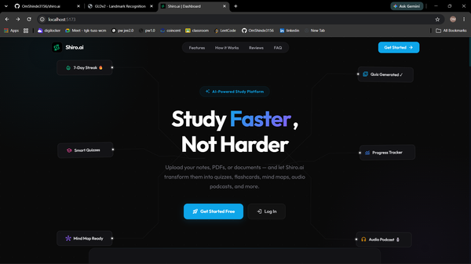

# Shiro.ai

> The Neon Curator - Transform your long study documents into an engaging, multi-episode podcast and active learning session.

<div align="center">
  <a href="images/image.png">
    
  </a>
</div>

## Description

> **Live Demo — Coming Soon**

Shiro.ai is an advanced, AI-powered study companion designed to transform any learning material into interactive, engaging, and dynamic study sessions. 
It solves the problem of passive reading by automatically generating study aids like quizzes, flashcards, mind maps, and full audio podcasts from any uploaded document. 
It is built for students, researchers, and professionals who want to maximize their learning efficiency and retention.

## Demo / Screenshots

*Click on any thumbnail to view the full resolution image!*

| Feature | Preview |
| :--- | :--- |
| **Dashboard / Home** | <a href="images/image copy.png"></a> |
| **My Library** | <a href="images/image copy 2.png"></a> |
| **Document Details & Chat** | <a href="images/image copy 9.png"></a> |
| **Study Tools & Flashcards** | <a href="images/image copy 3.png"></a> |
| **Starfish Mind Maps** | <a href="images/image copy 4.png"></a> |
| **Quiz System** | <a href="images/image copy 5.png"></a> |
| **Learning Analytics** | <a href="images/image copy 6.png"></a> |
| **Audio Podcasts** | <a href="images/image copy 7.png"></a> |
| **Feynman Room** | <a href="images/image copy 8.png"></a> |

## Features

- **Document Processing**: Upload PDFs or notes to extract knowledge.
- **Starfish Mind Maps**: Visually explore interconnected concepts generated directly from your documents.
- **Podcast Generation**: Turn long documents into engaging, multi-episode audio study sessions using AI TTS.
- **Feynman Room**: Test your understanding by teaching concepts back to the AI.
- **Smart Flashcards & Quizzes**: Automatically generated active recall tools to test memory.
- **RAG Chat Assistant (Shiro)**: Chat directly with your documents for deep dive explanations.
- **Progress Tracking**: Analytics dashboard to track your study sessions and mastery.
## Architecture Diagram

[Click here to view the Shiro.ai Architecture Diagram (High Resolution)](docs/RAG-Model%20Algorithm.jpg)

## Tech Stack

Shiro is built on a modern, scalable architecture using the following technologies:

**Frontend (Client)**
- **JavaScript (ES6+)**: The primary language for client-side logic.
- **React.js**: Core UI library for building the interactive interfaces.
- **Vite**: Ultra-fast build tool and development server.
- **Tailwind CSS**: Utility-first CSS framework for custom neon styling.
- **Context API**: Native React state management for themes, auth, and podcasts.

**Backend (Server & Processing)**
- **Python 3.11+**: The core language powering the AI logic and API.
- **FastAPI**: High-performance asynchronous web framework for building the REST API.
- **JWT Authentication**: Secure Bearer Token (OAuth2) based authentication for API security.
- **Celery**: Distributed task queue handling heavy asynchronous jobs (like podcast generation).
- **Redis**: In-memory data structure store, used as the message broker for Celery.

**Database & AI Infrastructure**
- **SQLite & SQLAlchemy**: Relational database and ORM for user data, progress, and metadata.
- **ChromaDB**: Local vector database for semantic search and Retrieval-Augmented Generation (RAG).
- **Google Gemini API**: The primary LLM powering chat, summarization, and content extraction.
- **Groq API**: Lightning-fast inference engine used for specialized, low-latency AI tasks.
- **Google Text-to-Speech (TTS)**: Synthesizes lifelike audio for the podcast generation feature.

## Prerequisites

- **Node.js 20+**
- **Python 3.11+**
- **Redis Server** (Running locally or via Docker for Celery tasks)
- **API Keys**: Google Gemini API Key and Groq API Key

## Installation / Setup

1. **Clone the repository**
   ```bash
   git clone https://github.com/OmShinde3156/shiro.ai.git
   cd shiro.ai
   ```

2. **Backend Setup**
   ```bash
   cd Backend
   python -m venv venv
   source venv/bin/activate  # On Windows: venv\Scripts\activate
   pip install -r requirements.txt
   ```

3. **Frontend Setup**
   ```bash
   cd ../buscul
   npm install
   ```

## Environment Variables

In the `Backend` directory, create a `.env` file containing the necessary API keys and configuration.
*(Note: Never commit your actual `.env` file to version control. Use `.env.example` as a template.)*

```env
# AI APIs
GEMINI_API_KEY=your_gemini_api_key_here
GROQ_API_KEY=your_groq_api_key_here

# Security
JWT_SECRET=generate_a_secure_random_string_here

# Redis / Celery (Optional depending on local setup)
CELERY_BROKER_URL=redis://localhost:6379/0
CELERY_RESULT_BACKEND=redis://localhost:6379/0
```

## Usage

**1. Start the Backend Server**
```bash
cd Backend
python main.py
```
*(Runs on `http://localhost:8000`)*

**2. Start the Background Worker (For Podcasts & Heavy Processing)**
In a separate terminal within the `Backend` directory:
```bash
celery -A celery_app worker --loglevel=info -P gevent
```

**3. Start the Frontend Development Server**
In a separate terminal within the `buscul` directory:
```bash
npm run dev
```
*(Runs on `http://localhost:5173`)*

## Project Structure

```
shiro.ai/
├── Backend/               # FastAPI Python backend
│   ├── routers/           # API Endpoints (features, auth, rooms, etc.)
│   ├── services/          # Core business logic (RAG, Podcasts, MindMaps)
│   ├── database/          # SQLite & ChromaDB setup
│   ├── static/            # Generated audio podcasts
│   └── main.py            # FastAPI application entry point
├── buscul/                # React Vite frontend
│   ├── src/
│   │   ├── components/    # Reusable UI components & Pages
│   │   ├── context/       # React Context (Auth, Theme, Podcasts)
│   │   ├── index.css      # Tailwind & Global styles
│   │   └── App.jsx        # Routing configuration
├── images/                # Screenshots and UI assets
└── README.md              # Project documentation
```

## API Documentation

Once the backend is running, FastAPI automatically generates interactive API documentation. You can explore and test all endpoints via Swagger UI at:
`http://localhost:8000/docs`

## Contributing

1. Fork the repository
2. Create your feature branch (`git checkout -b feature/AmazingFeature`)
3. Commit your changes (`git commit -m 'Add some AmazingFeature'`)
4. Push to the branch (`git push origin feature/AmazingFeature`)
5. Open a Pull Request

## License

Distributed under the MIT License. See `LICENSE` for more information.

## Author / Contact

- GitHub: [@OmShinde3156](https://github.com/OmShinde3156)

## Status / Roadmap

- [x] RAG Document Chat
- [x] Automated Flashcards & Quizzes
- [x] Feynman Learning Room
- [x] Multi-episode Podcast Generation
- [x] Starfish Mind Maps
- [ ] Multi-user Study Rooms (In Progress)
- [ ] Youtube Integration
