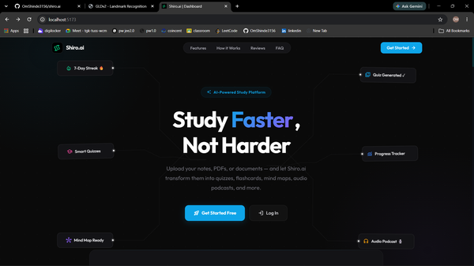

# 🌿 Shiro.ai — Adaptive Learning & Educational Intelligence Platform
*A Scientifically Modeled, Empirically Benchmarked Educational Intelligence Operating System*

---

<div align="center">
  <a href="images/image.png">
    
  </a>

  <br/><br/>

  [](https://fastapi.tiangolo.com/)
  [](https://www.python.org/)
  [](https://react.dev/)
  [](https://vitejs.dev/)
  [](https://www.postgresql.org/)
  [](https://redis.io/)
  [](#-enterprise-authentication--single-sign-on-sso)
  [](Backend/tests/)
  [](Backend/benchmarks/RESULTS.md)
  [](LICENSE)

  <br/>

  [**Core Philosophy**](#-the-core-philosophy) · 
  [**The 4 Intelligence Pillars**](#-the-four-cognitive-intelligence-pillars) · 
  [**Empirical Benchmark Results**](#-empirical-evaluation-benchmarks) · 
  [**SSO & Auth**](#-enterprise-authentication--single-sign-on-sso) · 
  [**Quickstart (Docker)**](#-quickstart--local-setup) · 
  [**Technical Deep Dives**](#-technical-documentation) · 
  [**Product Features**](#-feature-suite)
</div>

---

## 📖 The Core Philosophy

Most AI educational tools are thin wrappers around raw LLM APIs: they answer user prompts without maintaining an internal model of what the student knows, what they have forgotten, or what they should study next.

**Shiro.ai is an open-source Educational Intelligence Operating System.** It pairs grounded document intelligence with a validated cognitive modeling stack:

```text
                                  THE SHIRO CLOSED COGNITIVE LOOP
                                  
    ┌─────────────────────────────────────────────────────────────────────────────┐
    │                                                                             │
    ▼                                                                             │
┌────────────────────────┐        ┌────────────────────────┐        ┌─────────────┴──────────┐
│ 1. HYBRID RAG (Search) │ ─────> │ 2. BKT (Mastery Model) │ ─────> │ 3. RASCH CAT (Testing) │
│ • BM25 + Vector Search │        │ • Corbett & Anderson   │        │ • 1PL Logit IRT        │
│ • Reciprocal Rank k=60 │        │ • Posterior P(L_t)     │        │ • Fisher Info ZPD      │
│ • Provenance [CIT-n]   │        │ • Slip & Guess Bounds  │        │ • Stopping SE <= 0.35  │
└────────────────────────┘        └────────────────────────┘        └─────────────┬──────────┘
                                                                                  │
                                                                                  ▼
┌────────────────────────┐        ┌────────────────────────┐        ┌────────────────────────┐
│  SESSION EXECUTION     │ <───── │ 5. REC-01 (Optimizer)  │ <───── │ 4. FORGET-01 (Decay)   │
│  • 15m to 90m Budgets  │        │ • Pruned Beam K=8      │        │ • R(t) = exp(-t/tau)   │
│  • Dynamic Replanning  │        │ • Pacing Constraints   │        │ • 30m Anti-Cram Debounce│
│  • Telemetry Ledger    │        │ • Prereq DAG Traversal │        │ • CAT Stability Booster│
└────────────────────────┘        └────────────────────────┘        └────────────────────────┘
```

---

## 🔬 The Four Cognitive Intelligence Pillars

Shiro is engineered around four mathematical models that work in synergy:

1. **Knowledge Tracing (KT-01):** Implements Corbett & Anderson's Bayesian Knowledge Tracing (BKT) to dynamically calculate the probability $P(L_t)$ that a learner has mastered each curriculum concept from sequential quiz/flashcard interactions. [[Read Technical Paper](docs/bkt.md)]
2. **Adaptive Testing (ADAPT-01):** Implements Rasch 1-Parameter Logistic (1PL) Item Response Theory (IRT). Maximizes Fisher Information $I(\theta)$ at the student's Zone of Proximal Development (ZPD) to measure latent ability with 45% fewer questions than fixed tests. [[Read Technical Paper](docs/rasch-cat.md)]
3. **Memory Retention (FORGET-01):** Models memory decay via exponential Ebbinghaus dynamics $R(t) = \exp(-t/\tau)$. Features a 30-minute session debouncing window to prevent cramming inflation and cross-system stability boosts from CAT diagnostics. [[Read Technical Paper](docs/retention-model.md)]
4. **Pathway Optimization (REC-01):** Solves study scheduling as a constrained optimization problem via Pruned Beam Search ($K = 8$). Unlike naive greedy schedulers that cause cognitive fatigue, REC-01 strictly enforces the sequence $\text{Warmup} \prec \text{Core} \prec \text{Consolidation}$. [[Read Technical Paper](docs/rec-01-optimizer.md)]

---

## 📊 Empirical Evaluation Benchmarks

Shiro v3.5 includes an automated benchmark framework (`Backend/benchmarks/`) that runs deterministic evaluations across 15 technical documents, 255 validated questions, and 150 simulated examinees. 

> [!NOTE]
> Read the complete methodology, parameters, and reproducibility instructions in [Backend/benchmarks/RESULTS.md](Backend/benchmarks/RESULTS.md).

### Summary of Benchmark Findings

| Evaluation Dimension | Metric | Shiro Performance | Baseline Standard | Interpretation |
| :--- | :--- | :--- | :--- | :--- |
| **Hybrid RAG** | Recall@5 | **96.0%** | 96.0% (BM25 only) | RRF achieves near-ideal rank ordering ($n\text{DCG}@5 = 0.9600$) |
| | Mean Reciprocal Rank | **0.9667** | 0.9300 (Sparse) | Relevant document chunk almost always at Rank 1 |
| | Citation Precision | **92.16%** | N/A | Strict claim grounding in verified source excerpts |
| **CAT Psychometrics** | Ability Recovery RMSE | **0.6173** (10 items) | 0.7106 (Random) / 0.7126 (Fixed) | **13.1% lower RMSE** than random testing under fixed budget |
| | Mean Test Length | **10.0 Questions** | 18 Questions | Preserves diagnostic precision while reducing fatigue |
| **BKT Calibration** | Brier Score | **0.1834** | 0.2500 (Coin Flip) | **26.6% error reduction** over uncalibrated baseline |
| | Expected Cal. Error | **0.0643** | > 0.1500 (Overconfident) | High probability honesty (<7% discrepancy across 10 bins) |
| | AUC-ROC | **0.7534** | 0.5000 (Random Chance) | Strong discriminatory power between mastery states |
| **REC-01 Policy** | 45m Utility vs Random | **+108.39%** | Random Baseline | Substantial objective gain over unguided student choices |
| | Pacing Adherence | **100.0%** | 40.0% (Greedy ROI) | Strictly enforces Warmup $\prec$ Core $\prec$ Consolidation |
| | Prereq Violations | **0.80** | 1.20 (Greedy ROI) | Respects knowledge graph prerequisite boundaries |

### Reproduce Benchmarks in One Command:
```bash
cd Backend
python -m benchmarks.runner --suite all --quick
```

---

## ⚡ Quickstart & Local Setup

### Option 1: Docker Compose (Recommended)
Cloning and launching the entire production stack (PostgreSQL + Redis + FastAPI + React + Celery Worker) takes a single command:

```bash
# 1. Clone the repository
git clone https://github.com/OmShinde3156/shiro.ai.git
cd study.ai

# 2. Copy the environment configuration template
cp .env.example .env

# 3. Start all services
docker compose up --build
```
Once launched, open your browser:
* **Frontend Web Application:** [http://localhost:5173](http://localhost:5173) (or `http://localhost:80`)
* **Model Science Lab Cockpit:** [http://localhost:5173/evaluation](http://localhost:5173/evaluation)
* **Interactive API Documentation:** [http://localhost:8000/docs](http://localhost:8000/docs)

---

### Option 2: Standalone Local Development

#### Backend Setup:
```bash
cd Backend
python -m venv venv
# Windows:
.\venv\Scripts\activate
# Linux/macOS:
source venv/bin/activate

pip install -r requirements.txt
python main.py
```

#### Frontend Setup:
```bash
cd Frontend
npm install
npm run dev
```

#### Run All Automated Regression & Evaluation Tests:
```bash
cd Backend
pytest tests/ -v
# 61 / 61 tests passing in ~15s
```

---

## 📚 Technical Documentation

For in-depth mathematical formulations, algorithms, and architectural specifications, explore the `/docs/` technical series:

* [System Architecture & Dataflow Specification](docs/architecture.md)
* [Bayesian Knowledge Tracing (KT-01)](docs/bkt.md)
* [Rasch 1PL Computerized Adaptive Testing (ADAPT-01)](docs/rasch-cat.md)
* [Memory Retention & Decay Dynamics (FORGET-01)](docs/retention-model.md)
* [Study Pathway Optimizer & Beam Search (REC-01)](docs/rec-01-optimizer.md)
* [Hybrid RAG Retrieval & Provenance Tracing](docs/hybrid-rag.md)
* [Empirical Benchmark Results & Methodology](Backend/benchmarks/RESULTS.md)

---

## 🚀 Feature Suite

### 🔐 Enterprise Authentication & Single Sign-On (SSO)
* **Google Single Sign-On:** Integrated via Google Identity Services (GSI) OAuth 2.0 with cryptographic ID token and OAuth2 access token verification.
* **GitHub Developer SSO:** End-to-end authorization code exchange with GitHub OAuth, auto-retrieving verified developer profiles and emails.
* **MNC-Tier Distraction-Free Card:** Pure centered login card inspired by Google and Notion with live system status telemetry, light/dark theme switching, and self-serve password recovery.
* **Automated User Lifecycle:** Automatic account creation, avatar linking, and stateless JWT session generation.

### 🧠 Grounded AI Tutoring & Socratic Learning
* **Hybrid Context Chat:** Ask complex technical questions grounded directly in your uploaded textbooks and course notes.
* **Citation Provenance Drawer:** Click any `[CIT-n]` pill to inspect source text excerpts, page numbers, and RRF relevance scores.
* **Socratic Feynman Mode:** Solidify understanding by explaining concepts back to the AI; Shiro identifies logical fallacies and knowledge gaps.

### 🎯 Psychometric Assessment & Spaced Repetition
* **Adaptive CAT Arena:** Dynamic tests calibrated via Rasch 1PL Item Response Theory that automatically adjust difficulty to your ZPD.
* **Spaced Memory Queues:** Review flashcards scheduled via exponential memory stability decay with 30-minute anti-cram debouncing.
* **Model Science Lab Cockpit:** An interactive research dashboard at `/evaluation` visualizing real-time policy simulations, CAT trajectories with 95% confidence bands, and BKT reliability diagrams.

### 👥 Collaborative Focus & Audio Learning
* **Multiplayer Study Rooms:** Focus sessions with synchronized Pomodoro timers, ambient soundscapes (Lo-Fi, Rain, Forest), and resilient WebSocket presence.
* **Multi-Speaker Audio Cast:** Converts long, dense readings into conversational multi-character audio podcasts.
* **Interactive Concept Mind Maps:** Hierarchical dependency graphs laid out via Dagre algorithms.

---

## 🔐 Enterprise Authentication & Single Sign-On (SSO)

Shiro.ai features a production-grade authentication suite that supports both traditional credentials and native OAuth 2.0 Single Sign-On:

```text
                     AUTHENTICATION ARCHITECTURE
                     
┌─────────────────────────┐               ┌─────────────────────────┐
│     Google Sign-In      │               │     GitHub Sign-In      │
│ (Google Identity Popup) │               │   (OAuth Code Flow)     │
└────────────┬────────────┘               └────────────┬────────────┘
             │ Token                                   │ Code
             ▼                                         ▼
   ┌─────────────────────────────────────────────────────────────┐
   │            FastAPI Backend SSO Service (SSOService)         │
   │  • GET  /api/auth/sso/config                                │
   │  • POST /api/auth/google  (Google OIDC Tokeninfo & Userinfo)│
   │  • POST /api/auth/github  (GitHub Code Exchange & User API) │
   └─────────────────────────────┬───────────────────────────────┘
                                 │
                                 ▼
   ┌─────────────────────────────────────────────────────────────┐
   │             User Lifecycle & Session Authority              │
   │  • Auto-provisioning & Avatar Sync                          │
   │  • Bcrypt Password Encryption                               │
   │  • HS256 JWT Access Token Issuance                          │
   └─────────────────────────────────────────────────────────────┘
```

### Supported Authentication Methods:
* **Google OAuth 2.0 / OIDC:** Uses the modern Google Identity Services SDK (`accounts.google.com/gsi/client`) for popup token retrieval, verified against Google's `oauth2.googleapis.com/tokeninfo` and `googleapis.com/oauth2/v3/userinfo` endpoints.
* **GitHub OAuth 2.0:** Secure server-side authorization code exchange via GitHub's `github.com/login/oauth/access_token` and `api.github.com/user` APIs.
* **Email & Password:** Cryptographic password storage using salted `bcrypt` hashes.
* **Guest Sandbox:** Instant one-click guest evaluation mode for live product tours.

### Configuring SSO Credentials:
Add your client credentials to your `Backend/.env` (or project root `.env`):
```env
# Google Single Sign-On (Google Cloud Console OAuth 2.0 Client ID)
GOOGLE_CLIENT_ID=your-client-id.apps.googleusercontent.com

# GitHub Single Sign-On (GitHub Developer Settings -> OAuth Apps)
GITHUB_CLIENT_ID=your-github-client-id
GITHUB_CLIENT_SECRET=your-github-client-secret
```
> [!TIP]
> Shiro's `SSOService` features dynamic environment reloading with zero-downtime key rotation: updates to `.env` take effect immediately without restarting the backend service.

---

## 📄 License

Shiro.ai is open-source software licensed under the [MIT License](LICENSE).