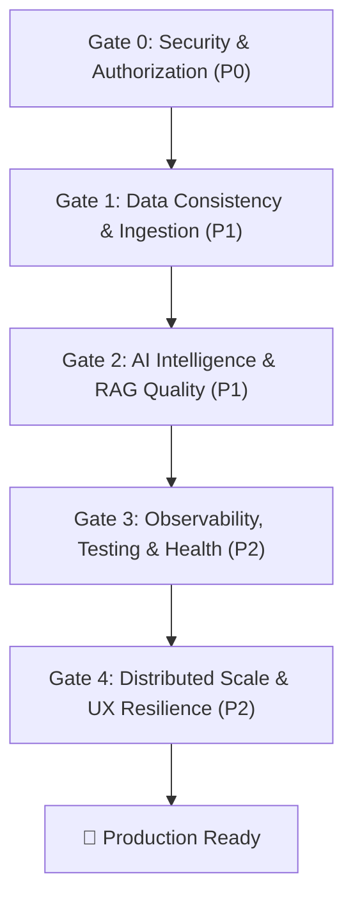

# 🛡️ Shiro.ai — Release-Gated Production Engineering Backlog & Implementation Blueprint

**Document Status**: Authoritative Engineering Specification  
**Architecture Goal**: Turn Shiro.ai into a production-grade AI Learning Operating System  
**Framework**: 5 Release Quality Gates (Release 0 through Release 4)

---

## 🏛️ Architecture Target

```text
                   SHIRO.AI
                      │
          ┌───────────┴───────────┐
          │     LEARNING CORE     │
          └───────────┬───────────┘
                      │
       ┌──────────────┼──────────────┐
       │              │              │
   KNOWLEDGE       LEARNER         ACTION
       │              │              │
     RAG             FSRS         Quizzes
     Graph           Mastery      Flashcards
     Sources         History      Feynman
     Documents       Weakness     Study Plans
       │              │              │
       └──────────────┼──────────────┘
                      │
                AI INTELLIGENCE
                      │
          Gateway • Retrieval • Eval
                      │
                PLATFORM CORE
                      │
       PostgreSQL • Redis • Workers
       Object Storage • Observability
                      │
                 SECURITY
```

---

## 🚦 Release Gate Overview



---

# 🚪 RELEASE GATE 0: Security & Authorization Baseline (P0)

> **Objective**: Eliminate all authentication bypasses, IDOR vulnerabilities, unauthenticated LLM endpoint consumption, global ORM memory leaks, and SSRF attack vectors.

---

### Item 0.1: [SEC-01] Document Authorization & IDOR Elimination
- **Target File**: [`Backend/routers/documents_router.py`](file:///c:/Users/omshi/Downloads/code%20and%20programs/study.ai/Backend/routers/documents_router.py)
- **Problem**: `DELETE /documents/{id}` and `PUT /documents/{id}/subject` lack `current_user` dependencies and ownership validation.
- **Required Changes**:
  ```python
  @router.delete("/documents/{document_id}")
  async def delete_document(
      document_id: int, 
      db: Session = Depends(get_db), 
      pdf_service: PDFService = Depends(get_pdf_service),
      current_user: User = Depends(get_current_user)
  ):
      success = pdf_service.delete_user_document(document_id, current_user.id, db)
      if not success:
          raise HTTPException(status_code=404, detail="Document not found or unauthorized")
      return {"message": "Document deleted successfully"}
  ```
- **Service Update** in `Backend/services/pdf_service.py`:
  ```python
  def delete_user_document(self, document_id: int, user_id: int, db: Session) -> bool:
      doc = db.query(Document).filter(Document.id == document_id, Document.user_id == user_id).first()
      if not doc:
          return False
      db.delete(doc)
      db.commit()
      return True
  ```
- **Test Case**: `tests/test_auth.py::test_delete_other_user_document_fails_with_404_or_403`
- **Acceptance Criteria**: Any delete/update request with a mismatched JWT token returns `404 Not Found` or `403 Forbidden`.

---

### Item 0.2: [SEC-02] Secure Study Rooms & WebSocket Authentication
- **Target Files**: [`Backend/routers/rooms_router.py`](file:///c:/Users/omshi/Downloads/code%20and%20programs/study.ai/Backend/routers/rooms_router.py), [`Backend/services/websocket_manager.py`](file:///c:/Users/omshi/Downloads/code%20and%20programs/study.ai/Backend/services/websocket_manager.py)
- **Problem**: `POST /rooms/` trusts `user_id` in request body. WebSocket endpoint `/ws/{room_id}/{user_id}` allows arbitrary user impersonation.
- **Required Changes**:
  1. Update `POST /rooms/`:
     ```python
     @router.post("/")
     async def create_room(
         room_data: RoomCreateRequest, # Pydantic model
         db: Session = Depends(get_db),
         current_user: User = Depends(get_current_user)
     ):
         new_room = StudyRoom(
             id=str(uuid.uuid4())[:8],
             name=room_data.name,
             subject=room_data.subject,
             description=room_data.description,
             is_public=room_data.is_public,
             document_id=room_data.document_id,
             created_by=current_user.id
         )
         ...
     ```
  2. Update WebSocket Handshake in `Backend/routers/rooms_router.py`:
     ```python
     @router.websocket("/ws/{room_id}")
     async def websocket_endpoint(
         websocket: WebSocket, 
         room_id: str, 
         token: Optional[str] = None,
         db: Session = Depends(get_db)
     ):
         user = get_user_from_token(token, db)
         if not user:
             await websocket.close(code=1008) # Policy Violation
             return
         await manager.connect(websocket, room_id, user.id, {"id": user.id, "name": user.name})
     ```
- **Test Case**: `tests/test_rooms.py::test_websocket_rejects_unauthenticated_connection`
- **Acceptance Criteria**: Connecting without a valid JWT token closes the connection with code `1008`.

---

### Item 0.3: [SEC-03] Authenticate All AI Endpoints
- **Target File**: [`Backend/routers/features_router.py`](file:///c:/Users/omshi/Downloads/code%20and%20programs/study.ai/Backend/routers/features_router.py)
- **Problem**: `generate-quiz`, `generate-flashcards`, and `generate-mindmap` do not require authentication.
- **Required Changes**:
  - Add `current_user: User = Depends(get_current_user)` to `/generate-quiz`, `/generate-flashcards`, `/generate-mindmap`, `/summarize`, and `/speak`.
  - Validate that `request.document_id` belongs to `current_user.id` before triggering generation.
- **Test Case**: `tests/test_features.py::test_unauthenticated_ai_requests_fail_401`
- **Acceptance Criteria**: Unauthenticated requests to AI endpoints are rejected immediately before invoking LLMs.

---

### Item 0.4: [BUG-01] Eliminate Global SQLAlchemy ORM Guest Cache
- **Target File**: [`Backend/utils/auth.py:83-106`](file:///c:/Users/omshi/Downloads/code%20and%20programs/study.ai/Backend/utils/auth.py#L83-L106)
- **Problem**: `_cached_guest_user` keeps an active ORM object across threads and requests, causing SQLAlchemy detached instance errors.
- **Required Changes**:
  ```python
  def get_guest_user(db: Session) -> User:
      """Resolve default Guest User (ID: 1) fresh within the active DB session."""
      guest = db.query(User).filter(User.id == 1).first()
      if not guest:
          guest = User(
              id=1,
              name="Guest User",
              email="guest@study.ai",
              password=hash_password("guest_secret_password_123"),
              preferred_language="en"
          )
          db.add(guest)
          db.commit()
          db.refresh(guest)
      return guest
  ```
- **Test Case**: `tests/test_auth.py::test_guest_resolution_across_multiple_sessions`
- **Acceptance Criteria**: Multiple sequential and concurrent requests accessing the guest user do not trigger `DetachedInstanceError`.

---

### Item 0.5: [SEC-04] SSRF Protection on Web & YouTube Ingestion
- **Target File**: [`Backend/services/research_service.py`](file:///c:/Users/omshi/Downloads/code%20and%20programs/study.ai/Backend/services/research_service.py)
- **Problem**: `upload-url` accepts arbitrary internal IPs and cloud metadata addresses.
- **Required Changes**:
  - Implement `validate_safe_url(url: str) -> bool` checking:
    1. Scheme is strictly `http` or `https`.
    2. Resolved IP addresses are checked using Python's `ipaddress.ip_address(ip).is_global`.
    3. Blocks `127.0.0.1`, `localhost`, `10.0.0.0/8`, `172.16.0.0/12`, `192.168.0.0/16`, and `169.254.169.254`.
- **Test Case**: `tests/test_documents.py::test_ssrf_urls_rejected`
- **Acceptance Criteria**: Submitting `http://127.0.0.1:8000` or `http://169.254.169.254/latest/meta-data` raises `HTTPException(400, "Disallowed IP target")`.

---

# 🚪 RELEASE GATE 1: Data Consistency & Ingestion Reliability (P1)

> **Objective**: Transition to event-driven spaced repetition tracking and replace unreliable in-process background tasks with a robust Celery-backed ingestion pipeline.

---

### Item 1.1: [DATA-01] Immutable FSRS Review Event Logs
- **Target Files**: [`Backend/models/database.py`](file:///c:/Users/omshi/Downloads/code%20and%20programs/study.ai/Backend/models/database.py), [`Backend/services/flashcard_service.py`](file:///c:/Users/omshi/Downloads/code%20and%20programs/study.ai/Backend/services/flashcard_service.py)
- **Database Schema Addition**:
  ```python
  class FlashcardReview(Base):
      __tablename__ = "flashcard_reviews"
      
      id = Column(Integer, primary_key=True, index=True)
      user_id = Column(Integer, ForeignKey("users.id"), nullable=False, index=True)
      flashcard_id = Column(String, ForeignKey("flashcards.id"), nullable=False, index=True)
      rating = Column(Integer, nullable=False) # 1=Again, 2=Hard, 3=Good, 4=Easy
      review_duration_ms = Column(Integer, default=0)
      fsrs_state_before = Column(Integer, default=0)
      fsrs_state_after = Column(Integer, default=0)
      stability_after = Column(Float, default=0.0)
      difficulty_after = Column(Float, default=0.0)
      reviewed_at = Column(DateTime, default=datetime.utcnow, index=True)
  ```
- **Service Integration**: On every `/study-flashcard` submission, calculate next FSRS interval, update `FlashcardProgress`, and append a new `FlashcardReview` event row.
- **Acceptance Criteria**: Review history is completely preserved for every card and user; analytics can reconstruct forgetting curves accurately.

---

### Item 1.2: [TASK-01] Celery Ingestion State Machine
- **Target Files**: [`Backend/models/database.py`](file:///c:/Users/omshi/Downloads/code%20and%20programs/study.ai/Backend/models/database.py), [`Backend/tasks.py`](file:///c:/Users/omshi/Downloads/code%20and%20programs/study.ai/Backend/tasks.py), [`Backend/services/pdf_service.py`](file:///c:/Users/omshi/Downloads/code%20and%20programs/study.ai/Backend/services/pdf_service.py)
- **Schema Update in `Document`**:
  - Add `status`: Column(String, default="QUEUED") — values: `QUEUED`, `PROCESSING`, `INDEXED`, `FAILED`.
  - Add `error_message`: Column(Text, nullable=True).
- **Worker Pipeline in `Backend/tasks.py`**:
  ```python
  @celery_app.task(name="tasks.process_document_ingestion", bind=True, max_retries=3)
  def process_document_ingestion_task(self, document_id: int, user_id: int):
      db = SessionLocal()
      try:
          doc = db.query(Document).filter(Document.id == document_id).first()
          doc.status = "PROCESSING"
          db.commit()
          
          # 1. Text chunking & page indexing
          # 2. Dense vector embedding in ChromaDB
          # 3. Knowledge Graph concept extraction
          
          doc.status = "INDEXED"
          db.commit()
      except Exception as exc:
          doc.status = "FAILED"
          doc.error_message = str(exc)
          db.commit()
          raise self.retry(exc=exc, countdown=10)
      finally:
          db.close()
  ```
- **Acceptance Criteria**: Uploading a 50-page PDF returns immediately with `status: "QUEUED"`; frontend polls status or receives completion notification; server reboots do not cause silent data loss.

---

# 🚪 RELEASE GATE 2: AI Intelligence & RAG Quality (P1)

> **Objective**: Centralize AI provider governance, establish prompt versioning, enforce output quality checks, and upgrade RAG to a hybrid search engine with exact page-level citations.

---

### Item 2.1: [AI-01] Centralized AI Gateway & Cost Governance
- **Target Files**: [`Backend/utils/llm_client.py`](file:///c:/Users/omshi/Downloads/code%20and%20programs/study.ai/Backend/utils/llm_client.py), [`Backend/models/database.py`](file:///c:/Users/omshi/Downloads/code%20and%20programs/study.ai/Backend/models/database.py)
- **Schema Addition**:
  ```python
  class AIRequestLog(Base):
      __tablename__ = "ai_request_logs"
      
      id = Column(Integer, primary_key=True, index=True)
      user_id = Column(Integer, ForeignKey("users.id"), index=True)
      feature = Column(String, nullable=False, index=True) # "quiz", "chat", "podcast"
      provider = Column(String, nullable=False) # "groq", "gemini", "openai"
      model = Column(String, nullable=False)
      prompt_version = Column(String, default="v1.0")
      input_tokens = Column(Integer, default=0)
      output_tokens = Column(Integer, default=0)
      latency_ms = Column(Integer, default=0)
      cost_usd = Column(Float, default=0.0)
      success = Column(Boolean, default=True)
      created_at = Column(DateTime, default=datetime.utcnow)
  ```
- **Prompt Registry**: Move prompts to `Backend/prompts/` with semantic version tags.
- **Acceptance Criteria**: Every AI generation logs exact tokens and costs; user rate limit tiers (Free: 20 calls/day, Pro: 200 calls/day) are enforced via Redis.

---

### Item 2.2: [RAG-01] Hybrid RAG Pipeline & Exact Page Citations
- **Target Files**: [`Backend/services/chat_service.py`](file:///c:/Users/omshi/Downloads/code%20and%20programs/study.ai/Backend/services/chat_service.py), [`Backend/utils/text_splitter.py`](file:///c:/Users/omshi/Downloads/code%20and%20programs/study.ai/Backend/utils/text_splitter.py)
- **Pipeline Architecture**:
  1. **Page-Aware Ingestion**: Chunks stored in ChromaDB carry `{"page_number": int, "filename": str, "document_id": int}` metadata.
  2. **Hybrid Search**: Dense semantic search (Sentence Transformers) + BM25 keyword matching.
  3. **Candidate Fusion & Grounded Prompt**:
     ```text
     CONTEXT CITATION TEMPLATE:
     [Source: {{doc_title}}, Page {{page_num}}]: {{chunk_content}}
     ```
  4. **Frontend Render**: Citations render as clickable badges in `MarkdownRenderer.jsx` linking to the PDF viewer page.
- **Acceptance Criteria**: AI answers cite specific page numbers; clicking a citation opens the PDF viewer directly at that page.

---

### Item 2.3: [AI-02] AI Output Quality Gate & Grounding Validation
- **Target File**: [`Backend/services/quiz_service.py`](file:///c:/Users/omshi/Downloads/code%20and%20programs/study.ai/Backend/services/quiz_service.py)
- **Quality Gate Pipeline**:
  ```python
  def validate_quiz_quality(questions: List[QuizQuestion], source_text: str) -> List[QuizQuestion]:
      valid_questions = []
      seen_questions = set()
      for q in questions:
          if q.question in seen_questions:
              continue
          # Check answer key matches option keys
          if q.correct_answer not in ["A", "B", "C", "D"]:
              continue
          seen_questions.add(q.question)
          valid_questions.append(q)
      return valid_questions
  ```
- **Acceptance Criteria**: No malformed, empty, or duplicate questions are ever returned to the user.

---

# 🚪 RELEASE GATE 3: Observability, Testing & Health (P2)

> **Objective**: Implement multi-tier health probes, structured JSON logging, and comprehensive automated test suites.

---

### Item 3.1: [OPS-01] Multi-Tier Dependency Health Checks
- **Target File**: [`Backend/main.py`](file:///c:/Users/omshi/Downloads/code%20and%20programs/study.ai/Backend/main.py)
- **Endpoints**:
  - `GET /health/live`: Liveness check (FastAPI process alive).
  - `GET /health/ready`: Readiness check verifying database connectivity:
    ```python
    @app.get("/health/ready")
    async def readiness_check(db: Session = Depends(get_db)):
        try:
            db.execute("SELECT 1")
            return {"status": "ready", "database": "connected"}
        except Exception as e:
            raise HTTPException(status_code=503, detail=f"Database unreachable: {e}")
    ```
  - `GET /health/dependencies`: Detailed health of PostgreSQL, Redis, ChromaDB, and Celery.
- **Acceptance Criteria**: Container orchestrators (Docker/Kubernetes) can accurately determine service health and route traffic only when dependencies are healthy.

---

### Item 3.2: [TEST-01] Comprehensive Test Suite & Pytest Matrix
- **Target Directory**: `Backend/tests/`
- **Structure**:
  ```
  tests/
  ├── conftest.py               # In-memory SQLite DB fixtures, mock LLM client
  ├── test_auth.py              # Signup, login, bcrypt, token expiration, guest auth
  ├── test_documents.py         # Upload, SSRF blocklist, IDOR permissions
  ├── test_flashcards.py        # FSRS algorithm, state transitions, review events
  ├── test_rooms.py             # Room creation, WebSocket token verification
  └── test_ai_gateway.py        # Fallback handling, token metering, rate limits
  ```
- **Acceptance Criteria**: `pytest tests/` runs in CI with 100% pass rate.

---

# 🚪 RELEASE GATE 4: Distributed Scale & Frontend Polish (P2)

> **Objective**: Scale real-time study rooms across multiple instances and enhance frontend resilience with auto-reconnecting WebSockets and dynamic configuration.

---

### Item 4.1: [WS-01] Redis Pub/Sub Distributed WebSocket Manager
- **Target File**: [`Backend/services/websocket_manager.py`](file:///c:/Users/omshi/Downloads/code%20and%20programs/study.ai/Backend/services/websocket_manager.py)
- **Architecture**:
  ```mermaid
  graph LR
      ClientA["Client A"] <-->|WS| API1["FastAPI Instance 1"]
      ClientB["Client B"] <-->|WS| API2["FastAPI Instance 2"]
      API1 <-->|Pub/Sub Channel| Redis[("Redis Channel: study_room:123")]
      API2 <-->|Pub/Sub Channel| Redis
  ```
- **Implementation**:
  - On room join: Subscribe local process to Redis channel `study_room:{room_id}`.
  - On broadcast: Publish message to Redis channel so all API replicas dispatch to their connected clients.
- **Acceptance Criteria**: Multiple backend replicas broadcast room chat and timer updates seamlessly.

---

### Item 4.2: [FE-01 & FE-02] Dynamic Vite Config & Auto-Reconnecting WebSockets
- **Target Files**: [`Frontend/src/api/config.js`](file:///c:/Users/omshi/Downloads/code%20and%20programs/study.ai/Frontend/src/api/config.js), [`Frontend/src/hooks/useWebSocket.jsx`](file:///c:/Users/omshi/Downloads/code%20and%20programs/study.ai/Frontend/src/hooks/useWebSocket.jsx), [`Frontend/src/components/pages/StudyRoom.jsx`](file:///c:/Users/omshi/Downloads/code%20and%20programs/study.ai/Frontend/src/components/pages/StudyRoom.jsx)
- **Environment Config**:
  ```javascript
  const API_BASE_URL = import.meta.env.VITE_API_URL || "http://127.0.0.1:8000";
  export default API_BASE_URL;
  ```
- **Auto-Reconnect Hook**:
  - Implements exponential backoff: `1s`, `2s`, `4s`, `8s`, `16s` max.
  - Shows visual status pill: 🟢 *Connected* / 🟡 *Reconnecting...* / 🔴 *Offline*.
- **Acceptance Criteria**: Temporary network drop automatically recovers connection without page refresh.

---

## 🎯 Verification & Sign-Off Checklist

| Release Gate | Verification Command | Gate Status |
|---|---|---|
| **Gate 0 (Security)** | `pytest tests/test_auth.py tests/test_documents.py tests/test_rooms.py` | ⏳ Ready to Execute |
| **Gate 1 (Data & Tasks)** | `pytest tests/test_flashcards.py` && Celery worker stress test | ⏳ Pending Gate 0 |
| **Gate 2 (AI & RAG)** | `pytest tests/test_ai_gateway.py` && RAG page citation validation | ⏳ Pending Gate 1 |
| **Gate 3 (Health & Tests)**| `curl http://localhost:8000/health/ready` && `pytest` full suite | ⏳ Pending Gate 2 |
| **Gate 4 (Scale & UX)** | Redis multi-process WebSocket test & Frontend offline simulation | ⏳ Pending Gate 3 |
